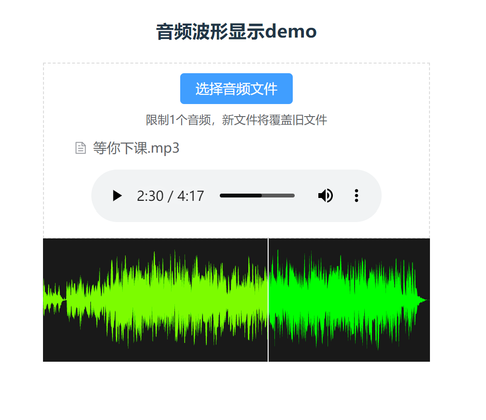

> 此次项目由本人 *唐杰华* 独立完成，记录一下
### 开始
1. npm install
2. npm run dev
3. 已上传GitHub：<https://github.com/uuuuuber/-dome.git>
--------------------
### 开发总结
* 使用vue3、vite构建项目
* 使用element plus的el-input el-button 组件 完成本地音频的选择 
* 将音频文件转为 base64--> blob url--> 显示到audio src
* 使用wavesurfer.js实现音频波形可视化，watch监听BlobUrl的变化
* 实现了音频时间和波形时间的同步进行，当拖动音频进度，波形进度也会变化，以音频进度为准。

 